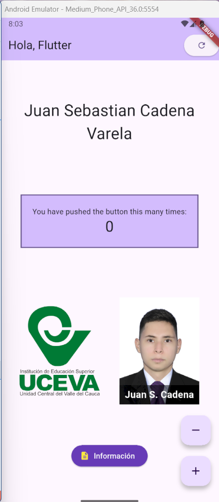
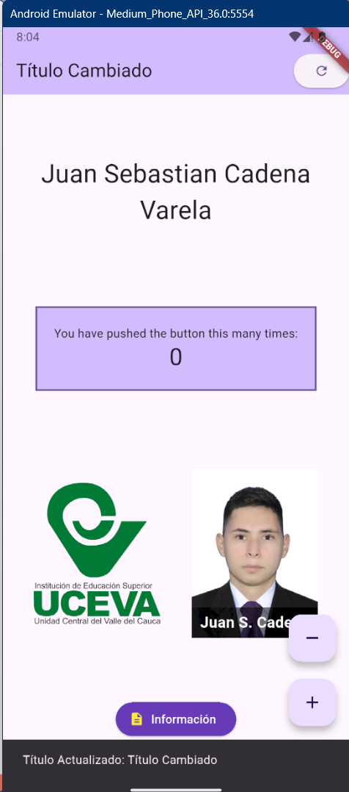

# Taller #1 - Flutter

## Descripción breve

Este proyecto consiste en una pantalla principal desarrollada en Flutter que demuestra el uso de widgets de estado, manejo de imágenes, diseño visual y control de eventos con setState(). Incluye AppBar, imágenes en un Row, Stack, botones y SnackBar.

## Pasos para ejecutar

1. Clona el repositorio o descarga el código fuente.
2. Abre la carpeta del proyecto en tu IDE.
3. Ejecuta en la terminal:
   - `flutter pub get`
   - `flutter run`

## Capturas y datos del estudiante

**Nombre:** Juan Sebastian Cadena Varela  
**Código:** 230221022

### Capturas de pantalla

Agrega aquí tus capturas de la app en ejecución:

